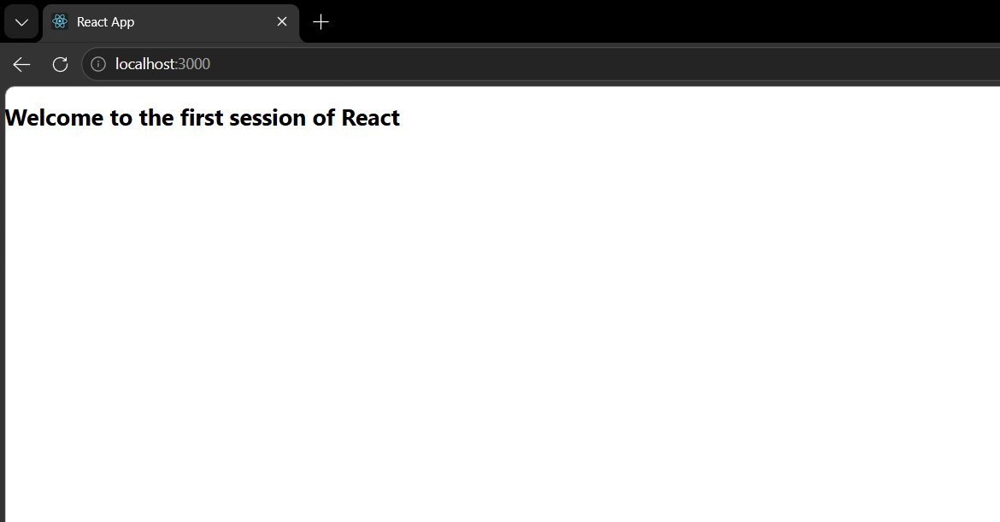

# ReactJS Hands-on 1

# Creating the First React Application

## Objective

Create a React application named **myfirstreact** and display the message:

> **Welcome to the first session of React**

---

# Theory

## Single Page Application (SPA)

A **Single Page Application (SPA)** is a web application that loads a single HTML page and dynamically updates its content without reloading the entire page. Instead of requesting a new page from the server, only the required data is fetched, providing a seamless user experience.

### Benefits of SPA

- Faster page loading after the initial request.
- Smooth navigation without page refresh.
- Better user experience.
- Reduced server requests.
- Easy integration with REST APIs.
- Efficient use of bandwidth.

---

## React

React is an open-source JavaScript library developed by **Meta (Facebook)** for building fast, interactive, and reusable user interfaces. It is widely used for developing Single Page Applications (SPAs).

### Working of React

1. User performs an action.
2. React updates the component state.
3. Virtual DOM is updated.
4. React compares the old and new Virtual DOM (Diffing).
5. Only the modified elements are updated in the Real DOM.
6. The browser displays the updated user interface efficiently.

---

## Difference Between SPA and MPA

| Feature | SPA | MPA |
|---------|-----|-----|
| Full Form | Single Page Application | Multi Page Application |
| Page Reload | No | Yes |
| Speed | Faster | Slower |
| User Experience | Smooth | Less Smooth |
| Server Requests | Fewer | More |
| SEO | More difficult | Better by default |
| Examples | Gmail, Facebook | Amazon, Banking Websites |

---

## Advantages of SPA

- High performance
- Faster navigation
- Better user experience
- Reduced server load
- Less bandwidth usage
- Easy API integration

---

## Disadvantages of SPA

- Longer initial loading time
- SEO requires additional configuration
- JavaScript dependency
- Higher browser memory usage
- More complex client-side development

---

## Features of React

- Component-Based Architecture
- Virtual DOM
- JSX (JavaScript XML)
- One-Way Data Binding
- Reusable Components
- High Performance
- Declarative UI
- Easy State Management
- Strong Community Support
- Cross-Platform Development using React Native

---

## Virtual DOM

The **Virtual DOM** is a lightweight copy of the Real DOM maintained by React. Whenever the application's state changes, React updates the Virtual DOM, compares it with the previous version, and updates only the changed elements in the Real DOM.

### Advantages of Virtual DOM

- Faster rendering
- Better performance
- Efficient DOM updates
- Improved user experience
- Reduced browser workload

---

# Technologies Used

- ReactJS
- JavaScript
- Node.js
- npm
- HTML5
- CSS3
- Visual Studio Code

---

# Software Requirements

- Node.js
- npm
- Visual Studio Code
- Modern Web Browser (Chrome/Edge)

---

# Project Structure

```
myfirstreact
│
├── node_modules
├── public
├── src
│   ├── App.js
│   ├── App.css
│   ├── index.js
│   └── ...
│
├── package.json
├── package-lock.json
└── README.md
```

---

# Implementation

## App.js

```javascript
function App() {
  return (
    <h1>Welcome to the first session of React</h1>
  );
}

export default App;
```

---

# Steps Performed

1. Installed Node.js and npm.
2. Created a React project using Create React App.
3. Opened the project in Visual Studio Code.
4. Modified the `App.js` file.
5. Added an `<h1>` element displaying the welcome message.
6. Saved the file.
7. Executed the application using:

```bash
npm start
```

8. Verified the output in the browser.

---

# Execution

Run the following command:

```bash
npm start
```

The application will start on

```
http://localhost:3000
```

---

# Output

```
Welcome to the first session of React
```

## Browser Output



---

# Conclusion

Successfully created the first React application using Create React App. The application demonstrates the basic structure of a React project and displays a simple welcome message. This hands-on also introduces the concepts of Single Page Applications (SPA), React, Virtual DOM, and React's component-based architecture.
