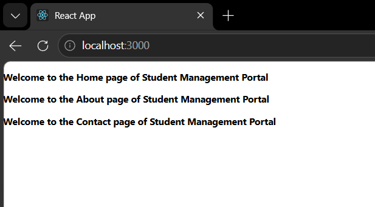

# ReactJS Hands-on 2

# Student Management Portal using React Components

## Objective

Create a React application named **StudentApp** that demonstrates the use of React components by displaying Home, About, and Contact pages.

---

# Theory

## What is a React Component?

A **React Component** is an independent and reusable piece of user interface. Components allow developers to divide the UI into smaller, manageable parts, making applications easier to develop and maintain.

---

## Types of Components

React provides two types of components:

### 1. Function Component

- Created using JavaScript functions.
- Simpler and easier to write.
- Uses Hooks for state management.

Example:

```jsx
function Home() {
    return <h1>Home Component</h1>;
}
```

---

### 2. Class Component

- Created using ES6 classes.
- Extends the `React.Component` class.
- Uses the `render()` method to display UI.
- Can maintain state and lifecycle methods.

Example:

```jsx
class Home extends React.Component {
    render() {
        return <h1>Home Component</h1>;
    }
}
```

---

## Difference Between Components and JavaScript Functions

| React Component | JavaScript Function |
|-----------------|---------------------|
| Returns JSX | Returns any JavaScript value |
| Used to build UI | Used for general programming |
| Can maintain state | Cannot maintain React state |
| Reusable UI blocks | General-purpose functions |

---

## Class Component

A Class Component is an ES6 class that extends `React.Component`. It must contain a `render()` method that returns JSX.

### Advantages

- Supports state.
- Supports lifecycle methods.
- Suitable for complex applications.

---

## Function Component

A Function Component is a JavaScript function that returns JSX.

### Advantages

- Easy to write.
- Faster and lightweight.
- Uses React Hooks.
- Preferred in modern React applications.

---

## Constructor

A constructor is a special method used for initializing the state and binding methods in a class component.

Example:

```jsx
constructor(props) {
    super(props);
    this.state = {};
}
```

---

## render() Function

The `render()` function is a mandatory method in a class component. It returns the JSX that will be displayed on the browser.

Example:

```jsx
render() {
    return (
        <h1>Hello React</h1>
    );
}
```

---

# Technologies Used

- ReactJS
- JavaScript
- HTML5
- CSS3
- Node.js
- npm
- Visual Studio Code

---

# Software Requirements

- Node.js
- npm
- Visual Studio Code
- Google Chrome / Microsoft Edge

---

# Project Structure

```
studentapp
│
├── node_modules
├── public
├── src
│   ├── Components
│   │   ├── Home.js
│   │   ├── About.js
│   │   └── Contact.js
│   │
│   ├── App.js
│   ├── index.js
│   └── App.css
│
├── package.json
├── package-lock.json
└── README.md
```

---

# Implementation

## Home.js

```jsx
import React, { Component } from 'react';

class Home extends Component {
    render() {
        return (
            <div>
                <h3>Welcome to the Home page of Student Management Portal</h3>
            </div>
        );
    }
}

export default Home;
```

---

## About.js

```jsx
import React, { Component } from 'react';

class About extends Component {
    render() {
        return (
            <div>
                <h3>Welcome to the About page of Student Management Portal</h3>
            </div>
        );
    }
}

export default About;
```

---

## Contact.js

```jsx
import React, { Component } from 'react';

class Contact extends Component {
    render() {
        return (
            <div>
                <h3>Welcome to the Contact page of Student Management Portal</h3>
            </div>
        );
    }
}

export default Contact;
```

---

## App.js

```jsx
import './App.css';

import Home from './Components/Home';
import About from './Components/About';
import Contact from './Components/Contact';

function App() {
    return (
        <div className="container">
            <Home />
            <About />
            <Contact />
        </div>
    );
}

export default App;
```

---

# Steps Performed

1. Created a React project named **studentapp**.
2. Created a **Components** folder inside the `src` directory.
3. Added three class components:
   - Home
   - About
   - Contact
4. Modified `App.js` to render all three components.
5. Executed the project using `npm start`.
6. Verified the output in the browser.

---

# Execution

Run the following command:

```bash
npm start
```

Open the browser:

```
http://localhost:3000
```

---

# Expected Output

```
Welcome to the Home page of Student Management Portal

Welcome to the About page of Student Management Portal

Welcome to the Contact page of Student Management Portal
```

---

# Output Screenshot

## Browser Output



---

# Conclusion

Successfully created a React application that demonstrates the use of multiple class components. The application renders Home, About, and Contact components through the main `App` component, illustrating React's component-based architecture.

---
