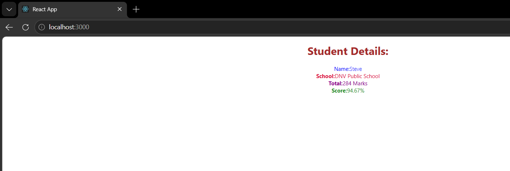

# ReactJS Hands-on 3

# Score Calculator Application using Function Component

## Objective

Create a React application named **scorecalculatorapp** that demonstrates the use of **Function Components**. The application accepts the student's Name, School, Total Marks, and Goal, calculates the average score, and displays the result with CSS styling.

---

# Theory

## What is a React Component?

A React Component is an independent and reusable piece of user interface. Components allow developers to split the UI into smaller parts, making applications easier to develop and maintain.

---

## Types of React Components

React provides two types of components:

### 1. Function Component

- Created using JavaScript functions.
- Returns JSX.
- Simpler and easier to understand.
- Supports Hooks for state management.

Example:

```jsx
function Welcome() {
    return <h1>Hello React</h1>;
}
```

### Advantages

- Lightweight
- Easy to write
- Better readability
- Preferred in modern React

---

### 2. Class Component

- Created using ES6 classes.
- Extends `React.Component`.
- Uses `render()` method.
- Supports lifecycle methods.

Example:

```jsx
class Welcome extends React.Component {
    render() {
        return <h1>Hello React</h1>;
    }
}
```

---

## Difference Between Function and Class Components

| Function Component | Class Component |
|-------------------|-----------------|
| Simple JavaScript Function | ES6 Class |
| Returns JSX | Uses render() |
| Uses Hooks | Uses State & Lifecycle |
| Less Code | More Code |
| Preferred in Modern React | Used in Older React Versions |

---

## Constructor

A constructor is a special method in a class component used to initialize state and bind methods.

Example:

```jsx
constructor(props){
    super(props);
    this.state = {};
}
```

---

## render() Function

The `render()` function is a mandatory method in every class component. It returns the JSX that should be displayed on the browser.

---

# Technologies Used

- ReactJS
- JavaScript (ES6)
- HTML5
- CSS3
- Node.js
- npm
- Visual Studio Code

---

# Software Requirements

- Node.js
- npm
- Visual Studio Code
- Google Chrome / Microsoft Edge

---

# Project Structure

```
scorecalculatorapp
│
├── node_modules
├── public
├── src
│   ├── Components
│   │      └── CalculateScore.js
│   │
│   ├── Stylesheets
│   │      └── mystyle.css
│   │
│   ├── App.js
│   ├── App.css
│   ├── index.js
│   └── ...
│
├── package.json
├── package-lock.json
└── README.md
```

---

# Implementation

## CalculateScore.js

```jsx
import "../Stylesheets/mystyle.css";

const percentToDecimal = (decimal) => {
    return (decimal.toFixed(2) + "%");
}

const calcScore = (total, goal) => {
    return percentToDecimal(total / goal);
}

export const CalculateScore = ({ Name, School, total, goal }) => {

    return (
        <div className="formatstyle">

            <h1>
                <font color="brown">Student Details:</font>
            </h1>

            <div className="Name">
                <b>Name:</b>
                <span>{Name}</span>
            </div>

            <div className="School">
                <b>School:</b>
                <span>{School}</span>
            </div>

            <div className="Total">
                <b>Total:</b>
                <span>{total}</span>
                <span> Marks</span>
            </div>

            <div className="Score">
                <b>Score:</b>
                <span>{calcScore(total, goal)}</span>
            </div>

        </div>
    );
}
```

---

## App.js

```jsx
import './App.css';
import { CalculateScore } from './Components/CalculateScore';

function App() {

  return (

    <div>

      <CalculateScore
        Name={"Steve"}
        School={"DNV Public School"}
        total={284}
        goal={3}
      />

    </div>

  );

}

export default App;
```

---

## mystyle.css

```css
.Name{
    font-weight:300;
    color:blue;
}

.School{
    color:crimson;
}

.Total{
    color:darkmagenta;
}

.formatstyle{
    text-align:center;
    font-size:large;
}

.Score{
    color:forestgreen;
}
```

---

# Steps Performed

1. Created a React project named **scorecalculatorapp**.
2. Created a **Components** folder.
3. Created a **Stylesheets** folder.
4. Added the `CalculateScore` function component.
5. Applied CSS styling using `mystyle.css`.
6. Passed data using props.
7. Calculated the score percentage.
8. Rendered the component from `App.js`.
9. Executed the application using `npm start`.

---

# Execution

Open terminal inside the project directory.

Run:

```bash
npm start
```

Open browser:

```
http://localhost:3000
```

---

# Expected Output

```
Student Details

Name: Steve

School: DNV Public School

Total: 284 Marks

Score: 94.67%
```

---

## Browser Output



---

# Conclusion

Successfully created a React application using a **Function Component**. The application demonstrates passing data through props, calculating the student's average score, applying CSS styling, and rendering the output using React.

---
