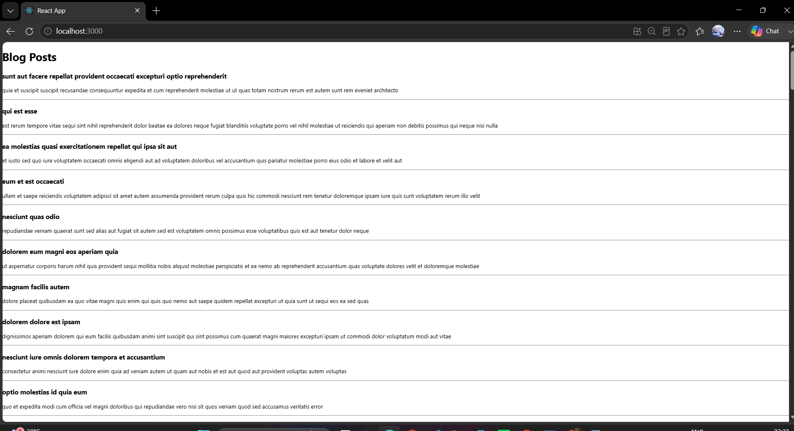

# ReactJS Hands-on 4

# Blog Application using React Component Lifecycle Methods

## Objective

Create a React application named **blogapp** to demonstrate React Component Lifecycle methods by fetching blog posts from a REST API using the Fetch API and displaying them in the browser.

---

# Theory

## What is Component Lifecycle?

The React Component Lifecycle is the sequence of phases a component goes through from creation to removal from the DOM.

The major phases are:

- Mounting
- Updating
- Unmounting
- Error Handling

Lifecycle methods allow developers to execute code during these phases.

---

## Need for Component Lifecycle

- Execute code when a component is created.
- Fetch data from APIs.
- Update UI when data changes.
- Handle errors gracefully.
- Improve application performance.

---

## Benefits of Component Lifecycle

- Better code organization.
- Easier API integration.
- Automatic UI updates.
- Better error handling.
- Efficient resource management.

---

## React Lifecycle Hook Methods

### Mounting Phase

- constructor()
- render()
- componentDidMount()

### Updating Phase

- shouldComponentUpdate()
- componentDidUpdate()

### Unmounting Phase

- componentWillUnmount()

### Error Handling

- componentDidCatch()

---

## Component Rendering Sequence

1. constructor()
2. render()
3. componentDidMount()

Whenever the state changes:

1. render()
2. componentDidUpdate()

If an error occurs:

1. componentDidCatch()

---

## componentDidMount()

`componentDidMount()` is invoked immediately after the component is inserted into the DOM.

It is commonly used for:

- Fetching data from APIs
- Database calls
- Initializing timers
- Loading external resources

Example:

```javascript
componentDidMount() {
    this.loadPosts();
}
```

---

## componentDidCatch()

`componentDidCatch()` is an error handling lifecycle method.

It catches JavaScript errors in child components and prevents the application from crashing.

Example:

```javascript
componentDidCatch(error, info) {
    alert(error);
}
```

---

# Technologies Used

- ReactJS
- JavaScript (ES6)
- HTML5
- CSS3
- Node.js
- npm
- Fetch API
- Visual Studio Code

---

# Software Requirements

- Node.js
- npm
- Visual Studio Code
- Google Chrome / Microsoft Edge

---

# Project Structure

```
blogapp
│
├── node_modules
├── public
├── src
│   ├── App.js
│   ├── Post.js
│   ├── Posts.js
│   ├── index.js
│   └── ...
│
├── package.json
├── package-lock.json
└── README.md
```

---

# Implementation

## Post.js

```javascript
class Post {

    constructor(id, title, body) {
        this.id = id;
        this.title = title;
        this.body = body;
    }

}

export default Post;
```

---

## Posts.js

```jsx
import React from "react";
import Post from "./Post";

class Posts extends React.Component {

    constructor(props) {
        super(props);

        this.state = {
            posts: []
        };
    }

    loadPosts() {

        fetch("https://jsonplaceholder.typicode.com/posts")
            .then(response => response.json())
            .then(data => {

                const posts = data.map(
                    item => new Post(item.id, item.title, item.body)
                );

                this.setState({
                    posts: posts
                });

            });

    }

    componentDidMount() {
        this.loadPosts();
    }

    componentDidCatch(error, info) {
        alert(error);
    }

    render() {

        return (

            <div>

                <h1>Blog Posts</h1>

                {

                    this.state.posts.map(post => (

                        <div key={post.id}>
                            <h3>{post.title}</h3>
                            <p>{post.body}</p>
                            <hr />
                        </div>

                    ))

                }

            </div>

        );

    }

}

export default Posts;
```

---

## App.js

```jsx
import './App.css';
import Posts from './Posts';

function App() {

  return (

    <div>
      <Posts />
    </div>

  );

}

export default App;
```

---

# Steps Performed

1. Created a React project named **blogapp**.
2. Created the `Post.js` model class.
3. Created the `Posts` class component.
4. Initialized state using the constructor.
5. Implemented the `loadPosts()` method using the Fetch API.
6. Used `componentDidMount()` to load posts after the component was mounted.
7. Implemented `componentDidCatch()` for error handling.
8. Rendered the fetched blog posts.
9. Added the `Posts` component to `App.js`.
10. Executed the project using `npm start`.

---

# Execution

Run the project using:

```bash
npm start
```

Open:

```
http://localhost:3000
```

---

# Output

The application fetches blog posts from:

```
https://jsonplaceholder.typicode.com/posts
```

and displays:

- Blog title
- Blog content

---

## Browser Output



---

# Conclusion

Successfully implemented a React application demonstrating Component Lifecycle Methods. The application uses `componentDidMount()` to fetch data from a REST API, renders the blog posts dynamically, and uses `componentDidCatch()` for error handling.

---
